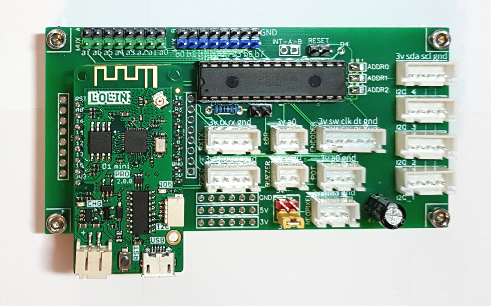
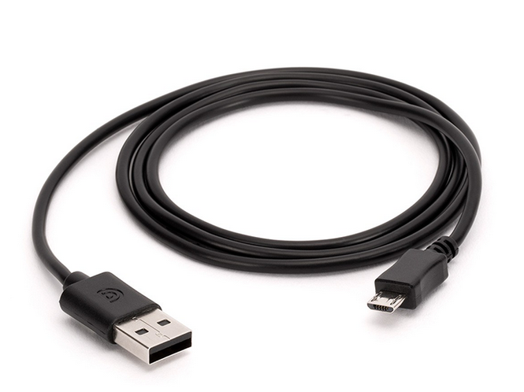
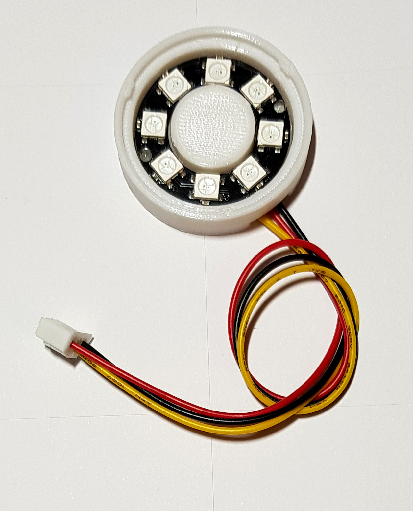
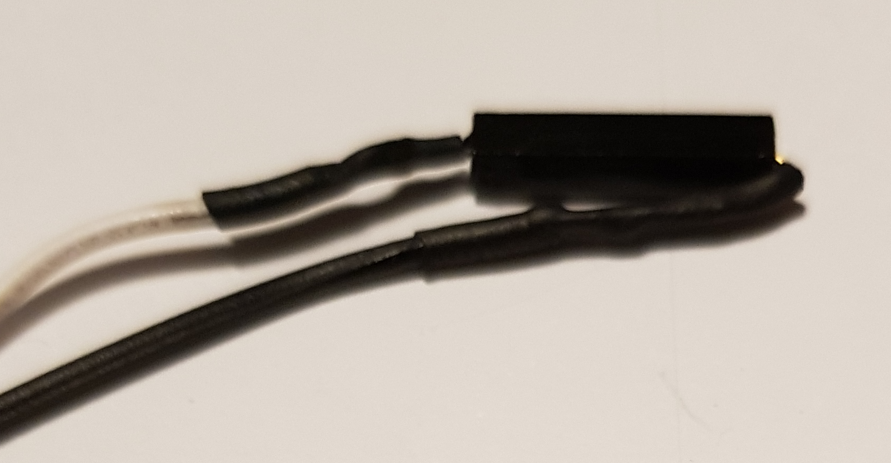
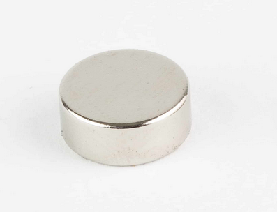
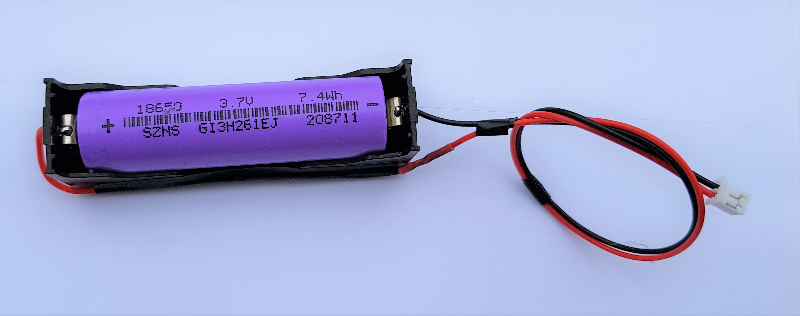

# serrure_medfan_02
Cet objet simule une serrure d'aspect magique qui s'ouvre et se ferme à l'aide d'un code qui doit être réalisé en activant des capteurs reed avec un aimant. Les capteurs sont cachés sous des glyphes illuminés par des led RGB. Le code est enregistré en mémoire. De nombreux paramètres sont configurables via un back office accessible en wifi. Cette version est plus difficilement hackable car le nombre de combinaison est beaucoup plus important

Dans la configuration “usine”, la serrure fonctionne de la façon suivante. Il y a 4 glyphes composés de 4 capteurs magnétiques et 4 groupes de 2 leds. Pour ouvrir ou fermer la serrure, il faut trouver la bonne séquence d’activation pour chaque glyphe. Chaque glyphe doit être activé une ou plusieurs fois avec un aimant afin de le positionner sur une des couleurs possibles (entre 1 et 5). Une fois tous les glyphes activés, la serrure attend un bref instant puis vérifie sila combinaison est la bonne. 

Si c’est le cas, la serrure change d’état (ouverte <==> fermée). Sinon, les glyphes sont tous désactivés et il faut recommencer depuis le début.

Le nombre de combinaisons est plus important que celui de la serrure medfan 01. Par exemple, 4 glyphes avec 3 couleurs possibles donnent 4^3  = 64 combinaisons.

**[Exemples](#Exemples)**  
**[Composants](#Composants)**  
**[Branchements](#Branchements)**  
**[BackOffice](#BackOffice)**  
**[Paramètres de gameplay](#param%C3%A8tres-de-gameplay)**  
**[Paramètres Réseau](#param%C3%A8tres-r%C3%A9seau)**  

## Exemples
Voici deux exemples de casing plus avancé :
 - Le premier est tout simple, il utilise l’anneau de leds du kit technoLARP.
 - Le deuxième est plus abouti, il utilise 9 leds et 9 capteurs reed avec un boitier en bois mdf peint.

Dans les 2 cas, les leds se trouvent derrière un diffuseur de lumière (une matière blanche translucide) et d’un masque (matière opaque) qui permet de former un texte visible à l’oeil nu!

## Composants
Vous aurez besoin pour monter la serrure medfan 01 :

|  | |
| :---------------- | :------: |
| Un kit technoLarp |  |
| Un câble micro-USB |  |
| Un ruban ou d’un anneau de led ws2812b ou neopixel |  |
| 4 capteurs magnétiques reed |  |
| Un aimant |  |
| Une batterie 18650 et son support |  |

## Branchements
Connecter les composants sur le kit technoLARP comme sur cette photo :

Ils vont sur les broches du MCP23017 (broches bleues/noires et broches vertes/noires) dans cet ordre :
*La numérotation des capteurs commence à 0 et non pas à 1*
|                 |    |
|-----------------|----|
| capteur reed 0  | a0 |
| capteur reed 1  | a1 |
| capteur reed 2  | a2 |
| capteur reed 3  | a3 |
| capteur reed 4  | a4 |
| capteur reed 5  | a5 |
| capteur reed 6  | a6 |
| capteur reed 7  | a7 |
| capteur reed 8  | b0 |
| capteur reed 9  | b1 |
| capteur reed 10 | b2 |
| capteur reed 11 | b3 |
| capteur reed 12 | b4 |
| capteur reed 13 | b5 |
| capteur reed 14 | b6 |
| capteur reed 15 | b7 |

**Attention au sens de numérotation des broches**

|                   |                   |
|-------------------|-------------------|
| **a7    <====    a0** | **b0   ====>     b7** |

Dans le kit technoLARP, il y a 4 capteurs reeds. Ils seront donc connectés sur les broches a0 à a3

Les capteurs ont 2 broches dupont femelles et se connectent de cette façon !
 - 1 fiche sur la broche verte ou bleue
 - la 2ème sur la broche noire au dessus (la couleur des fils n’a pas d’importance)

Exemple pour le capteur n°1

Exemple avec les 4 capteurs

## Installation
Pour installer le firmware de l'objet, il faut suivre ce [tutorial](https://github.com/technolarp/technolarp.github.io/wiki/Installation-du-firmware)  

## BackOffice
Pour se connecter au back office de l'objet, il faut suivre ce [tutorial](https://github.com/technolarp/technolarp.github.io/wiki/Connexion-au-back-office-de-l'objet-via-le-wifi)  

## Paramètres de gameplay

Ces paramètres permettent de contrôler le gameplay de l’objet.

| Nom         | Descriptif                                                                                                                         |
|---------------------|----------------------------------------------------------------------------------------------------------------------------------------------------------------------------------|
| Object name      | Le nom de l’objet, composé de 1 à 20 lettres et chiffres                                                                                                                                                                                                  |
| Object ID        | Un numéro d’identification de l’objet                                                                                                                                                                                                                     |
| Group ID         | Un numéro d’identification du groupe de l’objet                                                                                                                                                                                                           |
| nbSegments       | Le nombre de segments du panneau. Un segment est un groupe de 1 à 5 leds. Nombre entre 1 et 20.                                                                                                                                                           |
| ledParSegment    | Le nombre de leds groupées pour chaque segment du panneau. Entre 1 et 5                                                                                                                                                                                   |
| ActiveLeds       | Le nombre total de leds utilisées par le panneau. Ce chiffre est calculé automatiquement (= nbColonnes X nbSegments). Il ne doit pas dépasser 25                                                                                                          |
| Brightness       | La luminosité des leds, entre 0 (éteinte) et 255 (pleine intensité)                                                                                                                                                                                       |
| Scintillement    | Le scintillement permet d’activer le scintillement des leds pour un effet visuel plus ou moins rapide. le slider permet de régler la vitesse du scintillement                                                                                             |
| Nombre couleurs  | Le nombre de couleurs possible pour chaque groupe de leds. entre 1 et 5                                                                                                                                                                                   |
| Couleurs         | Le choix de chaque couleurs (est égal au nombre de couleurs)                                                                                                                                                                                              |
| couleurs fermée  | Choix de la couleur quand la serrure est fermée                                                                                                                                                                                                           |
| couleurs ouverte | Choix de la couleur quand la serrure est ouverte                                                                                                                                                                                                          |
| Manage Code      | Ces 2 boutons permettent de remettre le code par défaut ou de le choisir de façon aléatoire                                                                                                                                                               |
| Code             | La séquence qui permet de fermer ou ouvrir la serrure. On commence à compter à partir de zéro. Dans l’exemple du webUI au dessus, Il faut positionner le glyphe 0 sur le bleu foncé, le glyphe 1 sur blanc, le glyphe 2 sur jaune et le glyphe 3 sur cyan |
| statut Panneau   | le statut actuel de l’objet. Il peut être  OUVERTE FERMEE OUVERTURE Les 3 boutons permettent de forcer l’état de la serrure                                                                                                                               |
| Timeout Reset    | le délai après lequel les glyphes activés sont éteints automatiquement                                                                                                                                                                                    |
| Debounce Time    | un paramètre à n pas modifier                                                                                                                                                                                                                             |
## Paramètres Réseau

Pour avoir le descriptif des paramètres réseau suivez ce [lien](https://github.com/technolarp/technolarp.github.io/wiki/Param%C3%A8tres-R%C3%A9seau)  
